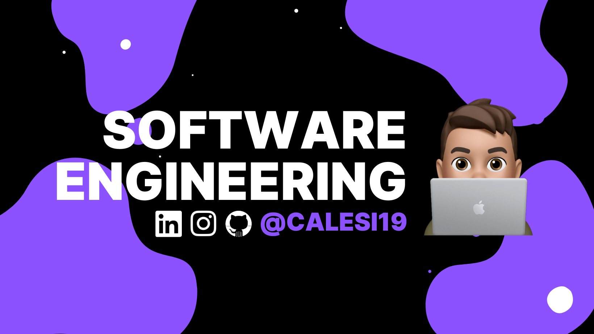
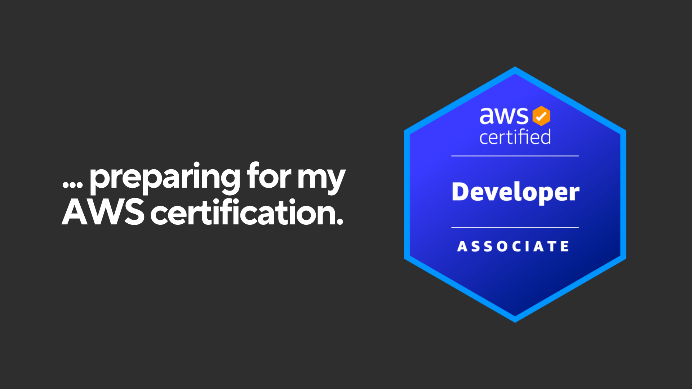

# 🔭 I’m currently working on ...

|                                                                                                                               |                                                                                                         |
| ----------------------------------------------------------------------------------------------------------------------------------------------------- | --------------------------------------------------------------------------------------------------------------------------------- |
|  |  |
|                                                                                 |    |

# Technologies I'm familiar with...

